# DockerDeployGHPages

# Config de Husky y Conventional commits

1. Instalar husky
```
yarn add -D husky
yarn dlx husky-init --yarn2 && yarn

```
2. Afegir el conventional commit
yarn add -D @commitlint/cli @commitlint/config-conventional

Mirar al `package.json`
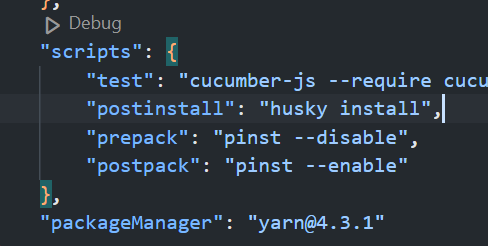

Crear el fitxer `commitlint.config.js` a el nostre directori `root`

dins posarem el següent codi

```JavaScript
module.exports = {
  extends: ["@commitlint/config-conventional"],
};
```
3. Executar husky install

Executarem la comanda `yarn run postinstall`

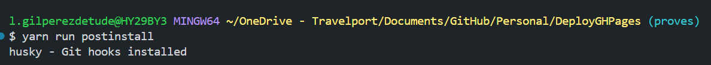

4. Afegirem la comprovació del message a husky

Ho farem per a que s'executi al fer un commit
`yarn husky add .husky/commit-msg "yarn commitlint --edit $1"`

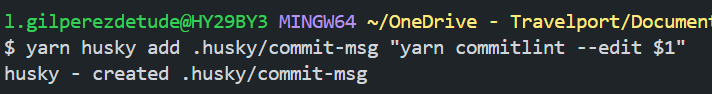

5. Com commitear

Si fem un commit normal, fallarà

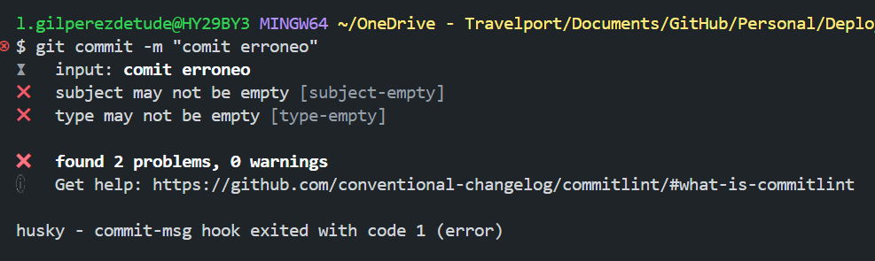

Per a fer un commit normal el que farem serà instalar la extensió de visual studio

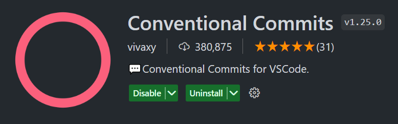

Per a fer un commit ara farem `ctrl + shift + P`

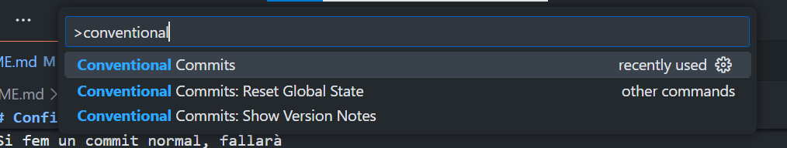
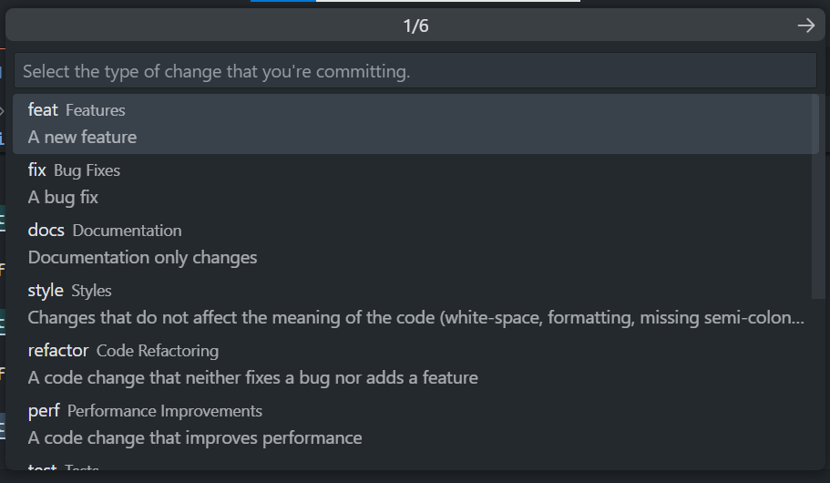
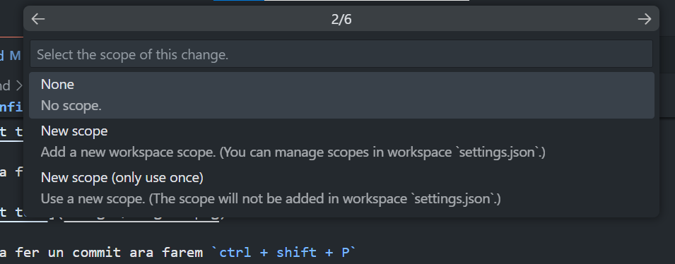
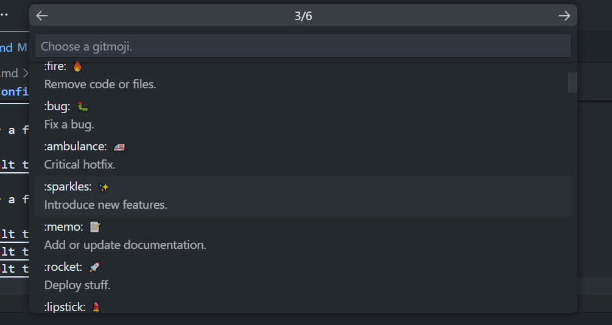
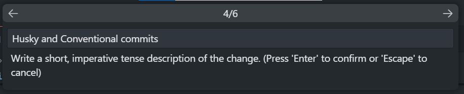
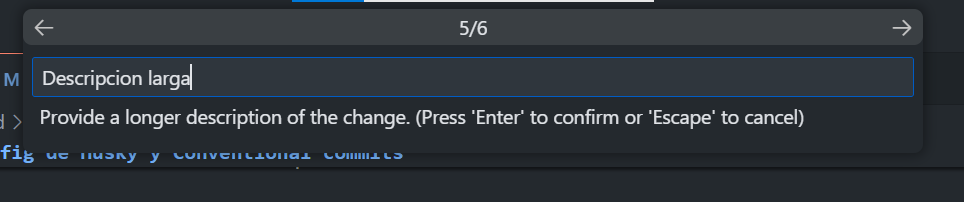
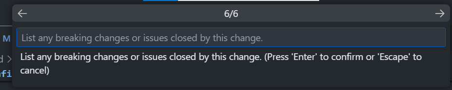
