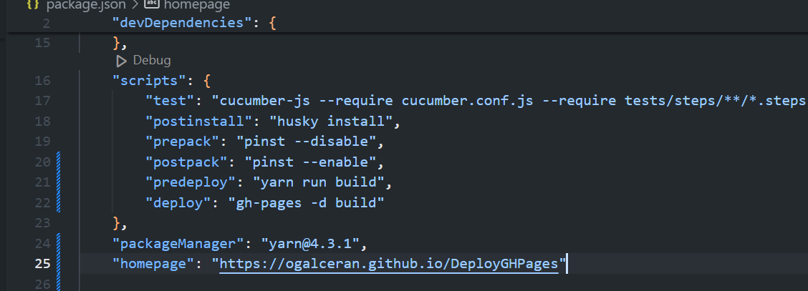
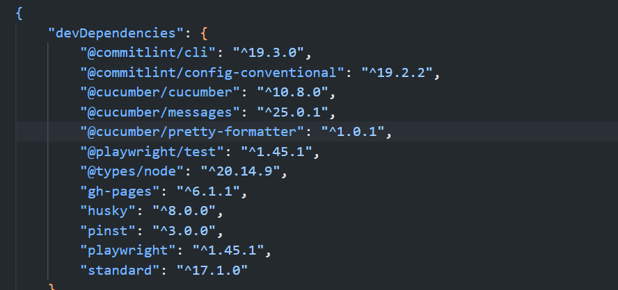
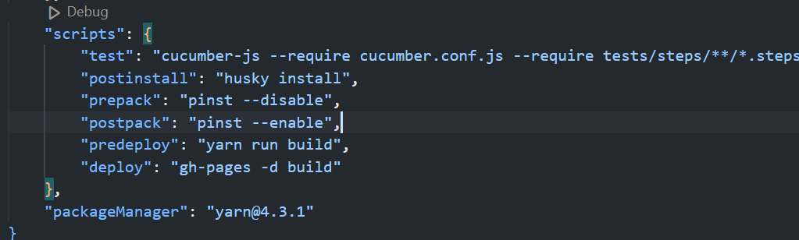

# DockerDeployGHPages

# Config de Husky y Conventional commits

1. Instalar husky
```
yarn add -D husky
yarn dlx husky-init --yarn2 && yarn

```

**yarn dlx husky-init --yarn2 && yarn**

Què fa cada part del comandament?
  ```bash
    yarn dlx: Executa una eina de manera temporal sense necessitat d'instal·lar-la globalment. És com un comandament ràpid per a executar scripts de paquets.

    husky-init: És l'script que inicialitza Husky al teu projecte. Husky és una eina per gestionar hooks de Git, com pre-commit, pre-push, etc.

    --yarn2: Indica que estàs utilitzant Yarn 2 o una versió superior. Això assegura que Husky es configuri correctament per a la teva versió de Yarn.

    &&: És un operador que permet encadenar comandaments. El segon comandament (en aquest cas, yarn) només s'executarà si el primer comandament es completa amb èxit.

    yarn: Aquest comandament s'executa després d'inicialitzar Husky per instal·lar totes les dependències i aplicar qualsevol configuració addicional necessària.
````
2. Afegir el conventional commit
yarn add -D @commitlint/cli @commitlint/config-conventional

Mirar al `package.json`


Crear el fitxer `commitlint.config.js` a el nostre directori `root`

dins posarem el següent codi

```JavaScript
module.exports = {
  extends: ["@commitlint/config-conventional"],
};
```
3. Executar husky install

Executarem la comanda `yarn run postinstall`


4. Afegirem la comprovació del message a husky

Ho farem per a que s'executi al fer un commit
`yarn husky add .husky/commit-msg "yarn commitlint --edit $1"`


5. Com commitear

Si fem un commit normal, fallarà


Per a fer un commit normal el que farem serà instalar la extensió de visual studio


Per a fer un commit ara farem `ctrl + shift + P`


# Create GH Action to Deploy to GH Pages
6. Add homepage in the package.json
```bash
  "homepage": "https://myusername.github.io",
```


7. Add Yarn `GH-Pages` deependences **# DE MOMENT NO!**

```bash
  yarn add --dev gh-pages

```


8. Add Scripts in the package.json **# DE MOMENT NO!**
```bash
    "predeploy": "yarn run build",
    "deploy": "gh-pages -d build"
```

